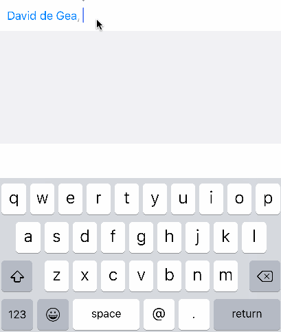
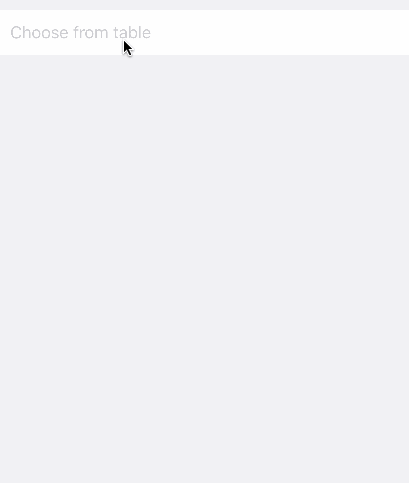
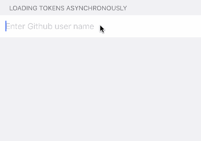

# TokenRow

<p align="left">

<a href="https://developer.apple.com/swift"></a>
<a href="https://cocoapods.org/pods/TokenRow"></a>
<a href="https://raw.githubusercontent.com/EurekaCommunity/TokenRow/master/LICENSE"></a>
</p>

By [Xmartlabs SRL](http://EurekaCommunity.com).


## Contents

* [Introduction](#introduction)
* [Usage](#usage)
* [Dependencies](#dependencies)
* [Requirements](#requirements)
* [Getting involved](#getting-involved)
* [Examples](#examples)
* [Installation](#installation)
* [Customization](#customization)

## Introduction

TokenRow is a row extension for Eureka. It includes a [CLTokenInputView] which allows the user to select, add and remove tokens.

 
 

TokenRow includes two rows with similar functionality but their options are displayed differently:
* TokenAccessoryRow: displays a collection view as the `inputAccessoryView` of the cell. The user will be able to scroll horizontally to select the desired token
* TokenTableRow: displays a `UITableView` directly below the cell for the user to choose the desired option.


## Usage

```swift
form +++ Section()
     <<< TokenAccessoryRow<String>() {
         $0.placeholder = "Choose from collection view"
         $0.options = ["Peter Schmeichel", "David de Gea", "Oliver Kahn", "Fabien Barthez", "Tim Howard", "Gianluigi Buffon"]
     }
     +++ Section()
     <<< TokenTableRow<String>() {
         $0.placeholder = "Choose from table"
         $0.options = ["Peter Schmeichel", "David de Gea", "Oliver Kahn", "Fabien Barthez", "Tim Howard", "Gianluigi Buffon"]
     }
```

To see what you can customize have a look at the [Customization](#customization) section.

## Dependencies
* [Eureka] 4.x
* [CLTokenInputView] which is a token view pod

## Requirements

* iOS 8.0+
* Xcode 8.3+

## Getting involved

* If you **want to contribute** please feel free to **submit pull requests**.
* If you **have a feature request** please **open an issue**.
* If you **found a bug** or **need help** please **check older issues before submitting an issue.**.

Before contributing check the [CONTRIBUTING](https://github.com/EurekaCommunity/TokenRow/blob/master/CONTRIBUTING.md) file for more info.

If you use **TokenRow** in your app we would love to hear about it! Drop us a line on [twitter](https://twitter.com/EurekaCommunity).

## Examples

Follow these steps to run Example project:
* Clone TokenRow repository
* Run `pod install` in the `TokenRow/Example` folder
* Open Example workspace in that folder


## Installation

#### CocoaPods

[CocoaPods](https://cocoapods.org/) is a dependency manager for Cocoa projects.

To install TokenRow, simply add the following line to your Podfile:

```ruby
pod 'TokenRow'
```

## TokenSearchable

The value of a token row (i.e. TokenAccessoryRow or TokenTableRow) must conform to the TokenSearchable protocol. This way you can have classes or structs as the values of this rows and not just Strings. The TokenSearchable protocol is defined as follows:
```swift
public protocol TokenSearchable: Hashable {
    var displayString: String { get }
    func contains(token: String) -> Bool
    var identifier: NSObject { get }
}
```

And here is a brief explanation for each of them:
* `displayString`: Will be used to get the String to be displayed as token in the token view
* `contains(token: String) -> Bool` is used to filter the options for a given search string.
* `identifier`: Is an identifier for the token and **should be unique among all options**

> Note that the value also has to conform to `Hashable` protocol which in turn requires `Equatable`

TokenRow includes an extension on `String` that makes it conform to `TokenSearchable` so that you can use any row with String as value. To make a class conform to this protocol you could do something like the following:
```swift
final class User {
    var id: Int = 0
    var name: String = ""
    var avatar: String?

	// conform to Hashable
    var hashValue: Int {
        return id
    }
}

// conform to Equatable
func == (lhs: User, rhs: User) -> Bool {
    return lhs.id == rhs.id
}

extension User: TokenSearchable {
    func contains(token: String) -> Bool {
        return name.contains(token)
    }

    var identifier: NSObject {
        return id
    }

    var displayString: String {
        return name
    }
}
```

## Customization

Many things of this row are very similar to the [SuggestionRow] and the [GooglePlacesRow]. You might find useful examples in those projects as well.

### General customization

There are several parts of the TokenRow that you can change. First of all, if you want to change the view that contains the tokens then you should have a look at [CLTokenInputView].

A thing you must do for each of these rows is provide the options from which the user can choose a token. The conventional way is to specify an array of options to the `options` variable of the row:

```swift
<< TokenAccessoryRow<String>() {
         $0.options = ["Peter Schmeichel", "David de Gea", "Oliver Kahn", "Fabien Barthez", "Tim Howard", "Gianluigi Buffon"]
     }
```

But you could also provide the options overriding `getTokensForString`. For example you could get the tokens asynchronously over a network call and reload the options after the response comes in.
For example:
```swift
row.getTokensForString = { [weak self, row] string in
        guard let me = self else { return nil }
        Alamofire.SessionManager.default.request("https://api.github.com/search/users?q=\(text)&per_page=5")
                .responseCollection(completionHandler: { (response: DataResponse<[User]>) in
                    switch response.result {
                    case let .success(value):
                        row.cell.filteredTokens = value
                        row.cell.reloadOptions()
                    case let .failure(error):
                        print(error)
                    }
                })
        return []
    }
```

It is as simple as that (at least if you are familiar with Alamofire). You can see a working example of this in the [Examples](#examples) project.

 

### TokenAccessoryRow
TokenAccessoryRow uses a generic `TokenCollectionCell` cell whose generic parameter is the UICollectionViewCell class used in the inputAccessoryView.

* If you just want to change minor things of the collection view cells (you most probably will want to) then the `customizeCollectionViewCell` callback is for you. This block is called in the delegate's `collectionView:cellForItemAtIndexPath:` method.

* If you want to change the **layout of the collectionView** then you can use/modify/override the `collectionViewLayout` attribute in the `cellSetup` method when declaring the row. Have a look at the examples for this.

* If you want to change something about the **collectionView** (e.g. its height, backgroundColor) then you can also do that in the `cellSetup` method. Just edit anything on the `collectionView` variable of your cell.

* If you want to **change the collection view cell of the inputAccessoryView** drastically then there is nothing easier than creating your own row (`CustomAccessoryRow`) with your own `MyCollectionViewCell`:
```swift
final class CustomAccessoryRow<T: TokenSearchable>: _TokenRow<T, CollectionTokenCell<T, MyCollectionViewCell<T>>>, RowType {
    required init(tag: String?) {
        super.init(tag: tag)
    }
}
```

> Note: Your custom `MyCollectionViewCell` has to conform to `EurekaTokenCollectionViewCell`

### TokenTableRow
TokenTableRow uses a generic `TokenTableCell` cell whose generic parameter is the UITableViewCell class used to create the cells displayed in a UITableView with the suggested options.

* If you just want to change minor things of the cells that display the options then you can use the `customizeTableViewCell` callback on the cell. You should define it in the `cellSetup` method. This callback will be called in the corresponding `tableView:cellForRowAtIndexPath:` method.

* You can customize attributes of the `tableView` that is displayed with the options. You should do this in `cellSetup` and keep in mind that the frame of the tableView is reset each time the tableView is displayed.

* If you want to change the cells of the options table view then there is nothing easier than creating your own row (`MyTokenTableRow`) with your own `MyTableViewCell`:
```swift
final class MyTokenTableRow<T: TokenSearchable>: _TokenRow<T, TableTokenCell<T, MyTableViewCell<T>>>, RowType {
    required public init(tag: String?) {
        super.init(tag: tag)
    }
}

```

You could also change `TableTokenCell` for any class you want to represent the TokenRow cell.

> Note: Make sure your cell conforms to `EurekaTokenTableViewCell`


## Author

* [Mathias Claassen](https://github.com/mats-claassen) ([@mClaassen26](https://twitter.com/mClaassen26)) ([@EurekaCommunity](https://twitter.com/EurekaCommunity))

# Change Log

This can be found in the [CHANGELOG.md](CHANGELOG.md) file.

[CLTokenInputView]: https://github.com/clusterinc/CLTokenInputView
[Eureka]: https://github.com/xmartlabs/eureka
[SuggestionRow]: https://github.com/EurekaCommunity/SuggestionRow
[GooglePlacesRow]: https://github.com/EurekaCommunity/GooglePlacesRow
